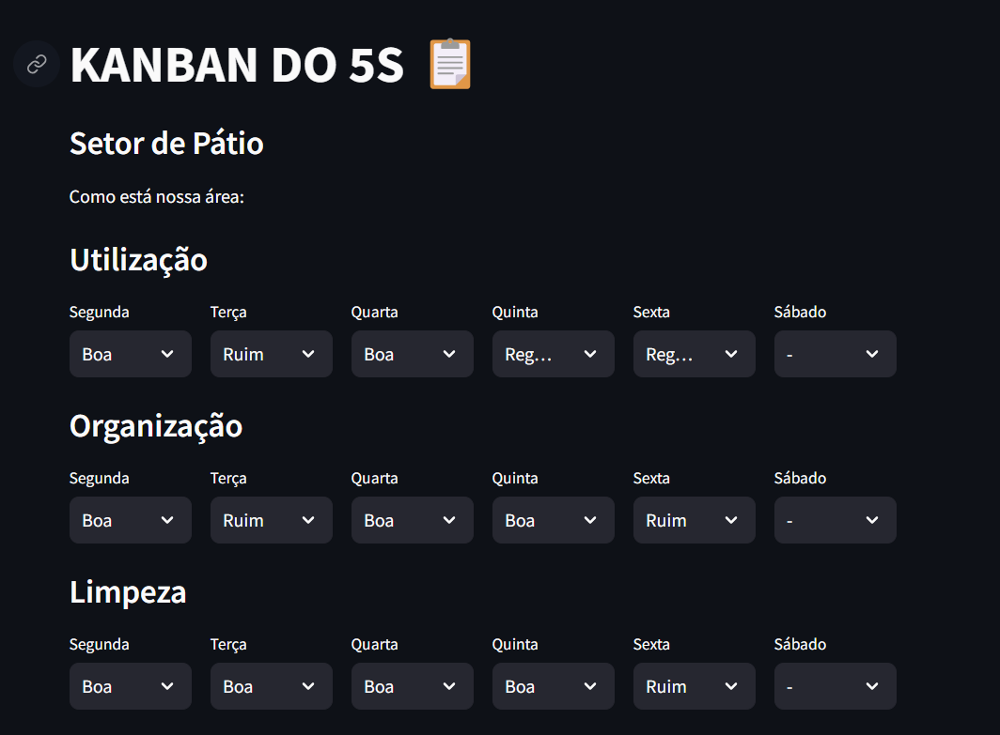
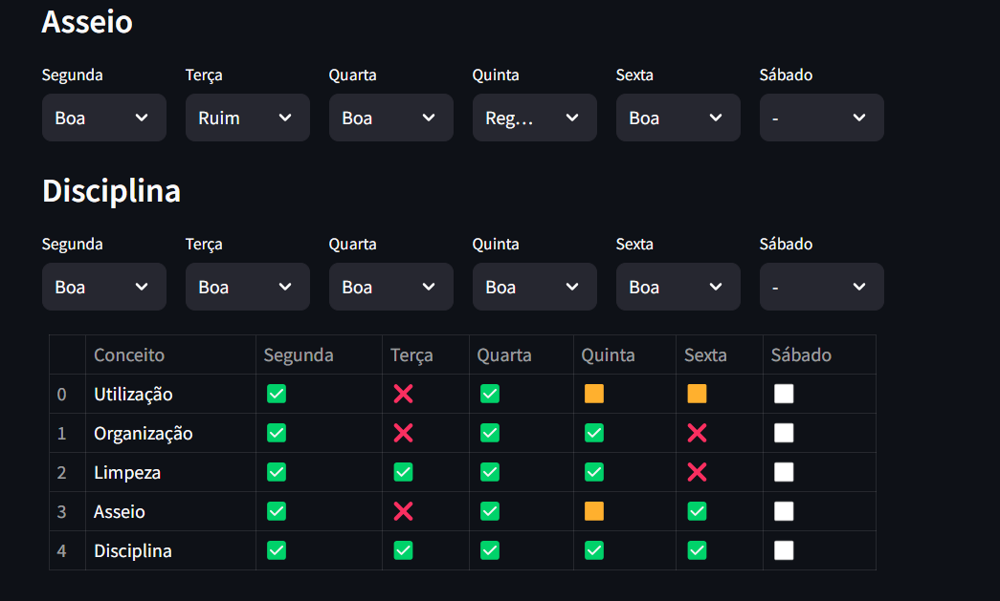

# Kanban do 5S 📋

Este projeto utiliza Streamlit para criar um Kanban interativo para monitorar o estado de conceitos do 5S em um setor específico.

## Descrição

O Kanban do 5S permite visualizar e gerenciar o estado de cinco conceitos principais: Utilização, Organização, Limpeza, Asseio e Disciplina. Cada conceito é representado por um emoji que reflete seu status atual.

## Como usar

1. **Configuração inicial:**
   - Instale as dependências necessárias usando `pip install -r requirements.txt`.

2. **Execução:**
   - Execute o aplicativo Streamlit com `streamlit run app.py`.

3. **Interagir com o Kanban:**
   - Para cada dia da semana, selecione o status atual de cada conceito usando os dropdowns disponíveis.
   - Os status são representados por emojis:
     - ✅ Boa
     - 🟨 Regular
     - ❌ Ruim
     - ⬜ Não avaliado

4. **Download dos dados:**
   - Após atualizar os estados, clique em "Baixar tabela em Excel" para obter um arquivo Excel com os dados atualizados.

5. **Instruções adicionais:**
   - Mova o arquivo baixado (`kanban_5s.xlsx`) manualmente para a pasta 'Database' após o download.

## Exemplo

